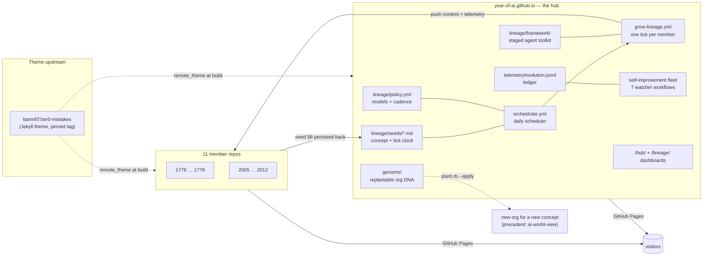

# Architecture — the year-of-ai federated knowledge network

This is the full technical reference for the `year-of-ai` organization and its
hub repo, `year-of-ai.github.io`. It documents how the system is put together,
why, and where every moving part lives.

**Reading map** — pick the document for your purpose:

| Document | Audience / purpose |
|---|---|
| [README.md](README.md) | First contact: what this repo is, quick commands |
| **ARCHITECTURE.md** (this file) | The complete system reference |
| [CLAUDE.md](CLAUDE.md) | Operational guardrails for AI agents working in this repo |
| [/orchestration/](https://year-of-ai.github.io/orchestration/) | Public, visual explainer of the growth model |
| [/self-improvement/](https://year-of-ai.github.io/self-improvement/) | Public explainer of the watcher fleet |
| [lineage/decisions/](lineage/decisions/) | ADRs — why each structural decision was made |

---

## 1. System overview

**Year of AI** is a federated network of self-growing knowledge bases: one
GitHub repository per year (`1776`–`1778`, `2005`–`2012`, …), each an
encyclopedic site about that year, each grown autonomously by AI on a schedule.
The org is deliberately **hub-and-spoke**:

- **Member repos hold only content.** No workflows, no theme files, no growth
  logic — just Markdown under taxonomy directories, a Pages `_config.yml`,
  thin `.claude/` adapters, and a `telemetry/` folder.
- **The hub (`year-of-ai.github.io`) owns everything else** and plays three
  roles at once:
  1. **Org root site + content hub** — the landing page and the `/hub/` +
     `/lineage/` dashboards that present every member.
  2. **Central growth engine** — the schedulers, prompts, seeds, policy, and
     framework that grow every member (ADR-0001).
  3. **Organizational genome** — the whole model abstracted into replantable
     DNA, so a new org can grow a different concept (ADR-0004).



Everything below expands one box of this picture.

---

## 2. Rendering architecture

Every site in the org — the hub and all members — is a **thin
`remote_theme` consumer** of [bamr87/zer0-mistakes](https://github.com/bamr87/zer0-mistakes),
built by **native GitHub Pages** ("deploy from branch": `main`, `/`). No repo
vendors theme files; there are no `_layouts/`, `_includes/`, `_sass/`, or
custom `_plugins/` anywhere in the org. Layout or style changes belong
upstream in the theme.

**The pin.** The theme ref is pinned to a tagged release
(`bamr87/zer0-mistakes@v1.26.0`) because all 12 sites build against it and the
theme ships several releases a week — a floating `HEAD` would let any upstream
push change or break every site at once (ADR-0006). The pin lives in **two
places that must move together**:

1. [`_config.yml`](_config.yml) `remote_theme:` — the hub site itself;
2. [`_data/hub.yml`](_data/hub.yml) `pages.theme_repo` — templated into each
   member's `_config.yml` by the provisioner.

Bump procedure: update both, verify with a local build, merge, then re-roll
member configs with `ruby scripts/provision-org-sites.rb`. Code that builds
URLs from `theme_repo` must strip the ref (`split('@').first`).

**The `_data` contract.** `remote_theme` supplies layouts/includes/assets but
**not** `_data`. The theme's templates read `site.data.*` at render time, so
the hub (and each member) must carry: `navigation/`, `ui-text.yml`,
`theme_skins.yml`, `theme_backgrounds.yml`, `authors.yml`, `landing.yml`.
Deleting these breaks rendering even though nothing references them in-repo.

**Local builds** fetch the theme over the network:
`JEKYLL_GITHUB_TOKEN=$(gh auth token)` avoids rate limits; a UTF-8 locale
(`LC_ALL=en_US.UTF-8`) is required (the theme's SCSS contains UTF-8 and SassC
dies under a POSIX locale); sandboxed environments need
`BUNDLE_PATH=<scratch>/bundle`.

---

## 3. Repository layout

### 3.1 The hub

| Path | Role |
|---|---|
| `_config.yml`, `_config_dev.yml` | Site config (prod / local-dev overlay). `remote_theme` pin; excludes keep `lineage/`, `genome/`, `telemetry/`, `scripts/`, `templates/`, and root docs out of the built site |
| `pages/` | The 8 site pages: `home.md` (landing), `hub.md` (dashboard), `lineage.md` (growth dashboard), `orchestration.md` + `self-improvement.md` (explainers), contact/privacy/terms |
| `_data/hub.yml` | **Registry — source of truth** for the org: org name, auto-discovery + `exclude_repos`, per-member titles, `pages.theme_repo` |
| `_data/hub_index.yml`, `_data/navigation/hub.yml` | **Generated** dashboard data (`scripts/sync-hub-metadata.rb`) — never hand-edit |
| `_data/lineage.yml` | **Generated** growth ledger (`scripts/sync-lineage-state.rb` from the seeds) — never hand-edit |
| `_data/fleet_pause.yml` | The global growth **kill-switch** (ADR-0003) |
| `lineage/seeds/<year>.md` | Each member's **concept DNA** (§1–7) + **Evolution Log** (§8, the tick clock) |
| `lineage/policy.yml` | Growth policy: model tiers, cadence, perpetual-growth doctrine |
| `lineage/framework/` | The canonical agent toolkit staged into ticks (§5.4) |
| `lineage/repo-template/` | Skeleton the planter drops into a new member (`CLAUDE.md`, `README.md`, `.claude/` adapters, `telemetry/`) |
| `lineage/decisions/` | ADR-0001 … ADR-0006 |
| `lineage/seed-package/` | Legacy bootstrap kit — **superseded** by `repo-template/` + the genome |
| `genome/` | The replantable org model: `genome.yml`, `manifest.yml`, `schema.json`, `bin/{render,plant,verify}.rb`, `GENOME.md` (§7) |
| `telemetry/evolution.jsonl` | Hub **evolution ledger** — one record per grow run (§6) |
| `scripts/` | Hub tooling (see table in [README.md](README.md#layout)) |
| `templates/org-site/` | Scaffold the provisioner writes into member repos |
| `templates/org-profile/` | Org profile README staged for the `year-of-ai/.github` repo |
| `templates/deploy/chat-proxy/` | Cloudflare Worker for the (currently disabled) AI-chat widget |
| `.github/workflows/` | 13 workflows: growth engine (2) + fleet (7) + content/site (4) — §5, §6 |

### 3.2 A member repo

```
2008/
├── _config.yml          # remote_theme consumer; url/baseurl → year-of-ai.github.io/2008/
├── CLAUDE.md            # planted guidance (from lineage/repo-template/)
├── README.md            # rendered as the member site's homepage
├── INDEX.md, TIMELINE.md
├── .claude/             # thin adapters: ~12 commands, 9 skills, 2 agents (§5.4)
├── <taxonomy dirs>/     # the content: history-politics/, science-technology/, … (era-1)
│                        #              military/, politics/, economics/, … (era-2)
└── telemetry/           # per-repo growth artifacts (presence varies by era)
```

Members have **no `.github/`** — procedures are staged in at tick time and
stripped before publish. Branch protection is intentionally off: the growth
bot pushes straight to `main`, and write races are prevented by the hub-side
`repo-write-<repo>` concurrency group instead (§5.6). All member commits are
authored by `claude-grow` with message `content: growth tick (Haiku -> Sonnet -> Opus)`.

---

## 4. Growth policy

[`lineage/policy.yml`](lineage/policy.yml) is the single knob panel. Honest
status of each knob:

| Knob | Value | Enforced by |
|---|---|---|
| `models.generate/expand/enhance` | haiku-4-5 / sonnet-4-6 / opus-4-8 | `grow-lineage.yml` resolves them per tick (guarded — a malformed value fails the run) |
| `models.distill` | opus-4-8 | doctrine only (no consumer yet) |
| `cadence.repos_per_run` | 4 | `orchestrate.yml` dispatch selection (stalest-first; `0` = everyone daily) |
| `cadence.selection` | stalest-first | descriptive label for the above |
| `cadence.cron` | `30 5 * * *` | mirrored by hand in `orchestrate.yml`'s schedule; templated by the genome at plant time |
| `cadence.ticks_per_run` | 1 | doctrine only |
| `lifecycle.*` (perpetual, no consolidate/archive/delete) | true/false | doctrine — enforced socially and by the framework staging **excluding** the consolidate/replant surfaces |
| `auth.*` | secret names | documentation of the required org secrets |

**Doctrine (ADR-0001, ADR-0002):** growth is perpetual — members are never
consolidated, archived, or deleted; new eras spawn *tangentially* from the
frontier rather than replacing it.

**Seeds** are the per-member DNA: §1–7 describe subject, taxonomy, source
strategy, and conventions; **§8 — Evolution Log** is the authoritative tick
clock (`### G<gen>-T<seq> — <date> — Tick N: <summary>` entries). Seeds are
45–78 KB and grow monotonically; the whole seed is staged into every pass
(a known cost — see §9).

---

## 5. The growth engine

Two workflows implement the entire growth path.

### 5.1 The daily orchestrate run

[`orchestrate.yml`](.github/workflows/orchestrate.yml) (cron `30 5 * * *`, or
manual with an optional `targets` list):

1. Refreshes `_data/lineage.yml` from the seeds (`sync-lineage-state.rb`) and
   commits it (rebase-retry) — this is what keeps the `/lineage/` and `/hub/`
   dashboards honest.
2. Checks the kill-switch; exits quietly if paused, or if `LIFECYCLE_PAT` is
   absent (tracking-only mode).
3. Selects members: `cadence.repos_per_run` stalest-first by the ledger's
   `last_activity` (members never grown sort first), or everyone if `0`.
4. Dispatches `grow-lineage.yml -f repo=<name>` once per selected member.

### 5.2 Anatomy of a tick

```mermaid
sequenceDiagram
    participant O as orchestrate.yml
    participant GT as gate job
    participant GR as grow job
    participant Y as year repo (checkout)
    participant H as hub (clone at /tmp/hub)
    O->>GT: workflow_dispatch repo=2008
    GT->>GT: kill-switch (raw fleet_pause.yml)
    GT->>GT: validate repo + args inputs
    GT->>GR: needs: gate (skipped entirely if paused)
    GR->>Y: checkout (LIFECYCLE_PAT, persist-credentials: false)
    GR->>H: clone hub, stage framework→.github/ (minus dead surfaces) + seed.md
    GR->>GR: resolve 3 models from lineage/policy.yml (guarded)
    GR->>Y: Tier 1 Haiku — draft topics (≤80 turns)
    GR->>Y: Tier 2 Sonnet — deepen drafts (≤80 turns)
    GR->>Y: Tier 3 Opus — polish, indices, sync-seed, encode-seed (≤120 turns)
    GR->>GR: check: real content changed? any tier is_error?
    alt no content OR errored
        GR->>Y: Fallback — full tick on ANTHROPIC_API_KEY (≤150 turns)
    end
    GR->>GR: upload telemetry artifact (last pass)
    GR->>H: persist seed §8 (safety-net entry if missing; rebase-retry ×5)
    GR->>Y: strip staged files → date gate (normalize-front-matter-dates --fix) → publish content+telemetry (rebase-retry ×3)
```

Key mechanics, in file order in
[`grow-lineage.yml`](.github/workflows/grow-lineage.yml):

- **Gate job** (ADR-0006): the kill-switch and input validation run in a
  separate job so that when it fails, none of the grow job's steps run —
  including its `if: always()` persist/publish steps, which a same-job check
  could not have stopped. `repo` must match `^[A-Za-z0-9][A-Za-z0-9._-]*$`;
  `args` rejects shell metacharacters and reaches shell only via `env:`.
- **Credential hygiene**: the checkout sets `persist-credentials: false`, so
  the org-wide PAT is never on disk while the model passes run with
  `Bash + WebFetch/WebSearch` over researched web content; pushes
  re-authenticate explicitly at push time (and scrub the stale
  `http.*.extraheader` claude-code-action leaves behind).
- **Prompt contract**: tiers 1–2 draft/deepen but never commit; tier 3
  polishes, rebuilds indices (`build-structure`), regenerates seed §1–7
  (`sync-seed`), and appends the §8 tick entry (`encode-seed`); the
  **workflow**, not the model, publishes. Front-matter dates must be single
  plain ISO dates (enforced twice: prompt + publish gate).
- **Fallback gate**: "the tick produced nothing" counts only changes *outside*
  the staged hub files; `is_error` is checked on **every** tier's snapshot
  (`/tmp/grow-tier{1,2,3}.json`), not just the last pass.
- **Seed persistence**: if content was published but the model forgot
  `encode-seed`, the workflow appends a deterministic §8 entry so the tick
  clock never lags reality, then pushes the seed back to the hub with
  rebase-retry ×5.
- **Publish**: strips `.github/ seed.md lifecycle.yml seed-package ROADMAP.md
  LIFECYCLE.md`, runs the **date gate** (`--fix`, refuses to publish anything
  still unparseable — the class of failure that took member 1777 offline for
  six days), commits as `claude-grow`, pushes with rebase-retry ×3.

### 5.3 The model escalation

Three passes per tick, models resolved from policy (never hardcoded):
**generate** (`claude-haiku-4-5`, cheap breadth) → **expand**
(`claude-sonnet-4-6`, depth and sourcing) → **enhance** (`claude-opus-4-8`,
polish + structure + seed bookkeeping). Primary auth is
`CLAUDE_CODE_OAUTH_TOKEN` (subscription); the **API-key fallback** runs one
complete tick on `ANTHROPIC_API_KEY` with the enhance-tier model when the
OAuth passes produced nothing or errored. Ledger-recorded cost is ~$3.4–4.8
per tick *for the final pass alone*; at `repos_per_run: 4` each member ticks
roughly every 3 days at about a third of the old daily-everyone spend.

### 5.4 Framework staging and the adapter mechanism

The canonical agent toolkit lives in
[`lineage/framework/`](lineage/framework/): 2 agents (architect, curator),
2 instruction files, 11 prompts, 9 skills, plus legacy `workflows/` and
`scripts/`. At tick time the staging step copies it into the member checkout's
`.github/` — **minus the dead peer-to-peer surfaces** (`workflows/grow|learn|
telemetry.yml`, `scripts/lineage.sh`, the `consolidate`/`replant`/`genesis`
prompts, and the `check-lifecycle` skill), which are unreachable under the
central model and contradict the perpetual-growth policy (ADR-0006). They
remain on disk as reference for a future spawning flow.

Member repos carry **thin `.claude/` adapters** (~20-line pointers): each
skill/command says "the canonical procedure is `.github/<path>` — read it and
follow exactly". The `claude` runtime discovers the adapter, the adapter sends
the agent to the canonical file, and the staging step is what makes those
pointers resolve during a tick. Outside a tick the pointers dangle *by
design* — member repos are not interactive dev environments. Do **not** "fix"
this by copying the framework into members or dropping the staging: the hub's
authority depends on members never carrying procedures.

### 5.5 Auth model

| Secret (org-level) | Used by | Purpose |
|---|---|---|
| `CLAUDE_CODE_OAUTH_TOKEN` | grow-lineage tiers 1–3 | Primary model auth (subscription) |
| `ANTHROPIC_API_KEY` | grow-lineage fallback; chat proxy | Fallback model auth |
| `LIFECYCLE_PAT` | orchestrate (dispatch), grow-lineage (member checkout/push + seed persist), pages-deploy-sentinel (cross-repo Pages reads) | The only credential that crosses repos |

Workflow-level `permissions:` are `contents: read` (grow adds `id-token:
write` for the claude-code-action OIDC exchange); writes happen via the PAT at
explicit push points only. `secret-expiry-watch.yml` probes credential
validity daily (note: its PAT probe currently proves hub *read* only).

### 5.6 Write serialization (ADR-0003 repo-write-serializer)

- Any writer of a **member's `main`** must join `concurrency.group:
  repo-write-<repo>` (grow-lineage holds it; `cancel-in-progress: false`).
- Every **hub-`main` pusher** retries with rebase: seed persist (×5),
  telemetry ledger (×5), orchestrate's ledger commit (×3), hub-sync (×3) —
  hub main advances many times a day and a plain push loses races.
- `framework-mutation` / `policy-mutation` concurrency groups are the naming
  convention reserved for future workflows that mutate those surfaces via PR;
  no current workflow does, so today they are doctrine, not code.
- **Kill-switch first**: every dispatching or mutating workflow reads
  `_data/fleet_pause.yml` before acting (orchestrate before dispatch;
  grow-lineage in its gate job; hub-sync before committing; the watchers
  before scanning).

---

## 6. The self-improvement fleet (ADR-0003)

Watchers that monitor the system that grows the content. All run on the hub;
all are read-only except for editing their own sticky issue / committing the
ledger.

| Workflow | Trigger | Watches | Acts by |
|---|---|---|---|
| [`telemetry-ledger.yml`](.github/workflows/telemetry-ledger.yml) | `workflow_run` of Grow Lineage | The run's telemetry artifact | Appending one `evolution-telemetry/v1` record to `telemetry/evolution.jsonl` (idempotent by run_id, serialized, rebase-retry) |
| [`fleet-health-watch.yml`](.github/workflows/fleet-health-watch.yml) | daily 07:23 | The ledger: stalls, error runs, unseen members (`scripts/fleet-health.rb`) | Sticky issue, auto-closed on recovery |
| [`pages-deploy-sentinel.yml`](.github/workflows/pages-deploy-sentinel.yml) | hourly :13 | Every member's Pages **build status** (via `LIFECYCLE_PAT`) + live HTTP. `errored`, `stuck-building` (>90 min), `unreadable`, or non-200 ⇒ unhealthy | Sticky issue, auto-closed on recovery |
| [`secret-expiry-watch.yml`](.github/workflows/secret-expiry-watch.yml) | daily 05:05 | OAuth token, API key, PAT validity | Sticky issue, auto-closed |
| [`framework-pr-reviewer.yml`](.github/workflows/framework-pr-reviewer.yml) | PRs touching `lineage/framework/**`, `repo-template/.claude/**` | Self-modification of the agent toolkit | Read-only Sonnet review + red-flag regex |
| [`docs-warden.yml`](.github/workflows/docs-warden.yml) | PRs + Tuesday sweep | Doc coverage vs `.github/config/docs_warden.yml` map (ADR-0005) | PR comments / sweep issue |
| [`genome-sync.yml`](.github/workflows/genome-sync.yml) | push/PR/weekly | Genome drift: unclassified concept-bearing files, leaks in the transplant tier (`genome/bin/verify.rb`) | Failing CI |

Plus baseline hygiene: [`codeql.yml`](.github/workflows/codeql.yml) and
[`.github/dependabot.yml`](.github/dependabot.yml) (actions + bundler), and
the content/site workflows: [`hub-sync.yml`](.github/workflows/hub-sync.yml)
(daily dashboard refresh), [`ai-content-review.yml`](.github/workflows/ai-content-review.yml)
(two-tier review of `pages/**` PRs), [`deploy-chat-proxy.yml`](.github/workflows/deploy-chat-proxy.yml).

**The ledger** is the fleet's shared signal. One line per grow run:

```json
{"schema":"evolution-telemetry/v1","run_id":"…","repo":"2008","conclusion":"success",
 "is_error":false,"num_turns":50,"input_tokens":6360,"output_tokens":35730,
 "cost_usd":4.08,"framework_sha":"…","started":"…","ended":"…"}
```

Known fidelity limits: it captures the **last pass only** (the fallback if it
ran, else enhance) and omits cache-token fields, so `input_tokens` understates
true usage.

---

## 7. The organizational genome (ADR-0004)

`genome/` abstracts the entire model so it can be replanted for a new concept
(the worked example: countries; the real precedent: **ai-world-view**, planted
2026-06 with member `japan` and a no-web-sources constraint).

- [`genome.yml`](genome/genome.yml) — the ONE concept manifest (~9 required
  fields: org, hub repo/domain, theme, concept nouns, growth constraints like
  `growth.web_sources: false`).
- [`manifest.yml`](genome/manifest.yml) — the transplant inventory. Every
  concept-bearing file is classified into a tier:
  - **transplant** — concept-agnostic, copied byte-for-byte (the framework,
    fleet workflows, agnostic scripts); the verify gate leak-scans these;
  - **template** — carries concept literals, tokenized `literal → {{TOKEN}}`
    at plant time (configs, growth workflows, provisioner);
  - **override** — templated overlays of otherwise-agnostic skeleton files;
  - **regenerate** — concept narrative re-authored by a genesis agent, never
    string-substituted (home/hub/orchestration pages, seeds);
  - **ignore** — never travels (instance content, generated data, this repo's
    own docs). A lexicon token (`year`→`country`) is applied only through
    curated exact phrases so Jekyll date syntax can never be corrupted.
- [`bin/verify.rb`](genome/bin/verify.rb) — the routine-sync gate wired into
  CI: fails if a tracked concept-bearing file is unclassified or a concept
  literal leaks into the transplant tier. This is what keeps the genome from
  rotting as the live repo evolves.
- [`bin/plant.rb`](genome/bin/plant.rb) — renders and plants a new org
  end-to-end (hub + member #1 via the planted tree's own planter). A default
  plant ships only the growth engine (orchestrate + grow-lineage + hub-sync);
  `--with-fleet` adds the watchers once the org matures. Two human steps
  remain by design: create the org, set the 3 secrets.

`lineage/seed-package/` predates the genome and is superseded by
`lineage/repo-template/` + `manifest.yml`.

---

## 8. Growing the org itself (ADR-0002)

New members spawn **tangentially from the frontier** (e.g. `2012` from the
2005–2011 era, the 1776 era from 2005–2011's precedent), never by replacing or
consolidating existing members. The planter,
[`scripts/plant-lineage.rb`](scripts/plant-lineage.rb), is deliberately
manual: dry-run by default, a real spawn needs `--apply --confirm <id>`; it
drops `lineage/repo-template/`, writes the new seed into `lineage/seeds/`, and
reuses `provision-org-sites.rb` for the Pages scaffold. (Known gap: it does
not yet append the new member to `_data/hub.yml` — that's how 2012 briefly
went missing from the dashboard.)

---

## 9. Failure modes, fragilities, and the runbook

Lessons encoded from the 2026-07 fleet review (ADR-0006):

| Failure class | What happens | Defense | Recovery |
|---|---|---|---|
| Bad front-matter `date:` (range/prose) | One bad value fails the member's **whole** Pages build; site serves stale content while grow runs stay green | Publish gate in grow-lineage + prompt rule | `ruby scripts/normalize-front-matter-dates.rb --fix <clone>` and push |
| Bare-year `date:` | Parses as epoch seconds → renders as 1970 | Same gate normalizes to `YYYY-01-01` | Same tool |
| Pages deploy flake ("Deployment failed, try again later") | Build succeeds, deploy fails/latches; site serves last good deploy | Sentinel flags `errored` and `stuck-building >90 min` | `gh api -X POST repos/year-of-ai/<repo>/pages/builds` |
| Upstream theme regression | Would hit all 12 sites at once | The version pin (§2) | Roll the pin back / forward deliberately |
| Silent no-op ticks | Grow runs conclude `success` with "nothing to publish" | Check step logs `content_changes`; fleet-health's stall rule; fallback now fires on empty ticks | Inspect the tier snapshots in the run |
| Hub-main push races | Seed/ledger/dashboard commits collide | Rebase-retry on every hub pusher | — |
| Fleet misbehavior | Anything | **Kill-switch**: set `paused: true` (+ `reason`) in `_data/fleet_pause.yml` — halts dispatch, ticks (gate job), and mutating commits | Flip back to `false` |

**Accepted residual risks** (documented, not yet engineered away): the seed §8
clock is persisted *before* the content publish step, so a failed publish can
advance the clock by one; seeds grow unboundedly and are staged whole into
every pass (trimming needs a merge-aware persist first); the telemetry ledger
is last-pass-only; `secret-expiry-watch`'s PAT probe is shallow.

---

## 10. Decision log

| ADR | Decision |
|---|---|
| [ADR-0001](lineage/decisions/ADR-0001-centralized-growth-orchestration.md) | Centralized growth orchestration in the hub |
| [ADR-0002](lineage/decisions/ADR-0002-tangential-era-spawning.md) | Tangential new-era spawning |
| [ADR-0003](lineage/decisions/ADR-0003-self-improving-agent-fleet.md) | The self-improving agent fleet — models watching models |
| [ADR-0004](lineage/decisions/ADR-0004-organizational-genome.md) | The organizational genome — replantable model DNA |
| [ADR-0005](lineage/decisions/ADR-0005-docs-warden.md) | docs-warden — documentation coverage as a fleet agent |
| [ADR-0006](lineage/decisions/ADR-0006-operational-hardening-and-cadence.md) | Operational hardening & growth cadence |

## 11. Invariants

The short list that everything above exists to protect:

1. **Members hold only content.** No workflows, no theme files, no seeds, no
   procedures in member repos — ever.
2. **The hub is authoritative.** Seeds, policy, framework, and dashboards live
   here; ticks stage procedures out and strip them before publish.
3. **Growth is perpetual and tangential.** Never consolidate, archive, or
   delete a member; new eras spawn beside the frontier.
4. **Generated files are never hand-edited** (`hub_index.yml`,
   `navigation/hub.yml`, `lineage.yml`) — edit the registry/seeds/policy and
   regenerate.
5. **Writers are serialized and pause-aware.** One concurrency group per
   written branch; rebase-retry on hub main; kill-switch checked before any
   dispatch or mutation.
6. **The theme is pinned** and bumped deliberately, in both pin locations at
   once.
7. **Published front matter is machine-valid** — dates are single plain ISO
   dates; the publish gate refuses anything else.
8. **The genome stays in sync** — every concept-bearing file is classified in
   `genome/manifest.yml`, enforced by CI.
